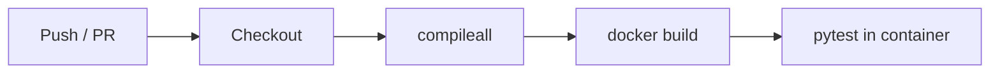

# ACEest Fitness & Gym

Automated CI/CD reference implementation for **CSI ZG514 / SEZG514 — Introduction to DevOps (Assignment 1)**.

ACEest is a Flask REST API for gym program management: training plans, calorie estimation, client profiles, and facility metrics. The project demonstrates version control, unit testing, Docker containerization, Jenkins BUILD quality gates, and GitHub Actions CI/CD.

**Repository:** https://github.com/2025tm93239/aceest-fitness

All commands below assume a **Bash** shell (Linux, macOS, or Git Bash on Windows).

---

## Table of contents

- [Overview](#overview)
- [Project structure](#project-structure)
- [Prerequisites](#prerequisites)
- [Local setup and execution](#local-setup-and-execution)
- [API reference](#api-reference)
- [Running tests manually](#running-tests-manually)
- [Docker](#docker)
- [GitHub Actions (CI/CD)](#github-actions-cicd)
- [Jenkins (BUILD and quality gate)](#jenkins-build-and-quality-gate)
- [Desktop baseline versions](#desktop-baseline-versions)
- [License and course context](#license-and-course-context)

---

## Overview

| Layer | Technology |
|-------|------------|
| Application | Python 3.9, Flask 3 |
| Tests | Pytest |
| Container | Docker (`python:3.9-slim`, Gunicorn) |
| CI | GitHub Actions (`.github/workflows/main.yml`) |
| BUILD server | Jenkins (`Jenkinsfile`, Pipeline from SCM) |

The API logic is derived from the instructor-provided ACEest desktop scripts (`versions/`), refactored into a modular Flask service under `aceest/`.

---

## Project structure

```
aceest-fitness/
├── app.py                      # Flask application entry point
├── aceest/
│   ├── programs.py             # Program catalog and gym metrics
│   ├── services.py             # Business logic (calories, validation)
│   └── storage.py              # In-memory client store
├── tests/
│   ├── conftest.py
│   ├── test_app.py             # API integration tests
│   └── test_services.py        # Unit tests for services
├── versions/                   # Historical Tkinter baseline scripts
├── Dockerfile
├── Jenkinsfile
├── requirements.txt
├── pytest.ini
├── .github/workflows/main.yml
└── docs/JENKINS-SETUP.md       # Detailed Jenkins configuration guide
```

---

## Prerequisites

- **Python 3.9+** (course Linux VM: **3.9.21**)
- **Git**

Verify on the VM:

```bash
python3 --version   # expected: Python 3.9.21
```
- **Docker** (for container build/run and CI parity)
- **Jenkins LTS** (local or lab server) for Assignment Step 5

---

## Local setup and execution

### 1. Clone the repository

```bash
git clone https://github.com/2025tm93239/aceest-fitness.git
cd aceest-fitness
```

### 2. Create a virtual environment and install dependencies

```bash
python3 -m venv .venv
source .venv/bin/activate
pip install -r requirements.txt
```

### 3. Run the Flask development server

```bash
python app.py
```

The server listens on **http://127.0.0.1:5000**.

**Health check:**

```bash
curl -s http://127.0.0.1:5000/ | python3 -m json.tool
```

Expected response:

```json
{
  "service": "ACEest Fitness & Gym",
  "status": "ok",
  "version": "1.0.0"
}
```

Stop the server with `Ctrl+C`.

---

## API reference

| Method | Endpoint | Description |
|--------|----------|-------------|
| `GET` | `/` | Health / service status |
| `GET` | `/metrics` | Gym capacity and break-even metrics |
| `GET` | `/programs` | List available program names |
| `GET` | `/programs/<name>` | Workout, diet, and calorie factor for a program |
| `POST` | `/calories` | Estimate daily calories (JSON body) |
| `GET` | `/clients` | List saved clients |
| `POST` | `/clients` | Create or update a client profile |
| `GET` | `/clients/<name>` | Get one client by name |

**Example — calorie estimation:**

```bash
curl -s -X POST http://127.0.0.1:5000/calories \
  -H "Content-Type: application/json" \
  -d '{"weight_kg": 70, "program": "Fat Loss (FL)"}' | python3 -m json.tool
```

**Example — create client:**

```bash
curl -s -X POST http://127.0.0.1:5000/clients \
  -H "Content-Type: application/json" \
  -d '{"name":"Ravi","age":28,"weight_kg":72,"program":"Muscle Gain (MG)","adherence_pct":85}' \
  | python3 -m json.tool
```

**Example — list programs:**

```bash
curl -s http://127.0.0.1:5000/programs | python3 -m json.tool
```

---

## Running tests manually

From the repository root with the virtual environment activated:

```bash
pytest -v
```

Syntax / compile check (same as CI lint stage):

```bash
python3 -m compileall -q app.py aceest tests
```

Tests cover:

- Service-layer calorie calculation and payload validation (`tests/test_services.py`)
- HTTP endpoints for health, programs, clients, and calories (`tests/test_app.py`)

Configuration: `pytest.ini` sets `pythonpath = .` so imports resolve correctly.

---

## Docker

Containerization packages the app and dependencies into a portable image (“write once, run anywhere”).

### Build the image

```bash
docker build -t aceest-fitness:latest .
```

### Run the API container

```bash
docker run -d -p 5000:5000 --name aceest aceest-fitness:latest
```

Open http://127.0.0.1:5000/ to verify.

### Run tests inside the image

```bash
docker run --rm aceest-fitness:latest pytest -v
```

### Stop and remove the container

```bash
docker stop aceest
docker rm aceest
```

**Image notes:**

- Base image: `python:3.9-slim` (aligned with lab VM Python 3.9.21)
- Application runs as non-root user `appuser`
- Production process: Gunicorn binding `0.0.0.0:5000`

---

## GitHub Actions (CI/CD)

Workflow file: **`.github/workflows/main.yml`**

### Triggers

- Every **push** to `main` or `master`
- Every **pull_request** targeting `main` or `master`

### Pipeline stages

1. **Build and lint** — Install `requirements.txt`, run `python -m compileall` on `app.py`, `aceest/`, and `tests/` to catch syntax errors.
2. **Docker image assembly** — `docker build -t aceest-fitness:ci .`
3. **Automated testing** — `docker run --rm aceest-fitness:ci pytest -v` (tests run in the containerized environment).

View run history: GitHub → **Actions** → workflow **Aceest Fitness CI/CD**.



---

## Jenkins (BUILD and quality gate)

Jenkins provides a **secondary, controlled BUILD environment** on a dedicated server (separate from GitHub-hosted runners).

Configuration file: **`Jenkinsfile`** (Pipeline script from SCM).

### Jenkins job setup (summary)

1. Create a **Pipeline** job (e.g. `aceest-fitness-build`).
2. **Pipeline script from SCM** → Git → `https://github.com/2025tm93239/aceest-fitness.git`
3. Branch: `*/main` (or your integration branch).
4. Script Path: `Jenkinsfile`
5. Run **Build Now**.

### Jenkins pipeline stages

| Stage | Purpose |
|-------|---------|
| Checkout | Pull latest code from GitHub |
| Install dependencies | Clean `pip install -r requirements.txt` |
| Build (compile / syntax) | `compileall` quality check |
| Quality gate — unit tests | `pytest -v` on the Jenkins agent |
| Docker build | Tag image `aceest-fitness:<BUILD_NUMBER>` |
| Tests in container | `pytest` inside the built image |

After each run, the workspace is cleaned (`deleteDir`) so the next build starts fresh.

**Integration logic (GitHub Actions vs Jenkins):**

| Aspect | GitHub Actions | Jenkins |
|--------|----------------|---------|
| When it runs | On GitHub push/PR | On Jenkins schedule, webhook, or manual build |
| Where it runs | GitHub `ubuntu-latest` runner | Your Jenkins agent (Linux or macOS recommended for Bash/`sh` stages) |
| Config | `.github/workflows/main.yml` | `Jenkinsfile` + job UI |
| Role | Continuous integration on every change | Primary **BUILD** and quality gate in a controlled lab environment |

Detailed Jenkins installation steps: [`docs/JENKINS-SETUP.md`](docs/JENKINS-SETUP.md).

---

## Desktop baseline versions

The `versions/` directory stores the original ACEest Tkinter applications supplied for the course (v1.0 through v3.2.4). The Flask API reuses the same program definitions and business rules in a web-service form suitable for DevOps tooling.

---

## License and course context

This project was developed for academic coursework at **BITS Pilani** (CSI ZG514 — Introduction to DevOps). Use and redistribution are subject to your institution’s academic integrity policies.

**Author:** Update with your name and BITS ID before submission.
